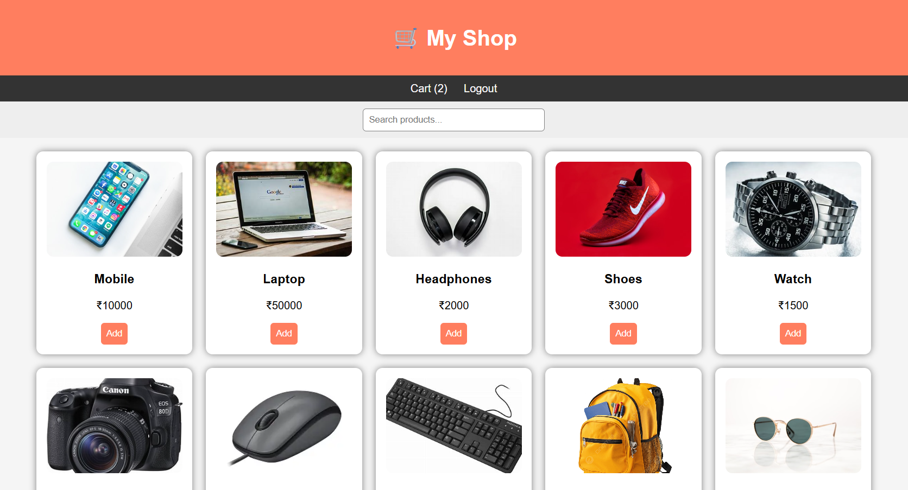
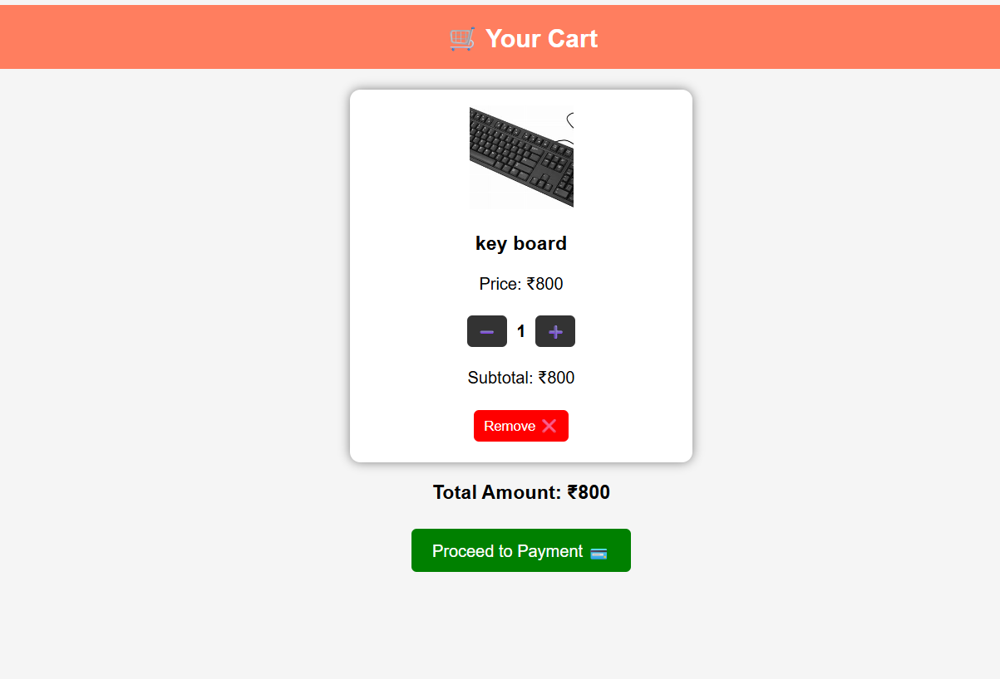

# 🛒 E-Commerce Website (Cash on Delivery)

This project is a simple E-Commerce Website developed using HTML, CSS, and JavaScript.  
It allows users to browse products, add them to cart, and place orders using Cash on Delivery (COD).

---

## 🚀 Features

- User Registration and Login  
- Product Listing Dashboard  
- Search Products  
- Add to Cart  
- Quantity Management (Increase / Decrease)  
- Cash on Delivery (COD)  
- Order Placement  
- Order Status Display (Processing)  

---

## 📁 Project Files

- index.html  
- login.html  
- register.html  
- dashboard.html  
- cart.html  
- payment.html  
- order.html  
- script.js  

---

## 🧑‍💻 Technologies Used

- HTML  
- CSS  
- JavaScript  
- LocalStorage (for storing cart and orders)  

---

## ▶️ How to Run

1. Open the project folder  
2. Run `index.html` or `login.html` in browser  
3. Register or Login  
4. Add products to cart  
5. Place order using Cash on Delivery  

---

## 📌 Note

This project does not use any backend or database.  
All data (cart, orders) is stored in the browser using LocalStorage.

---

## 🔮 Future Improvements

- Admin Panel  
- Online Payment Integration  
- Order Tracking System  
- Database Integration  

---

## 📸 Screenshots

### 🔐 Login Page

### 📝 Register Page

### 🛍️ Dashboard

### 🛒 Cart

### 📦 Orders
![Orders](orders.png

---

## 👨‍💻 Author

B.Satya Hyndavi
